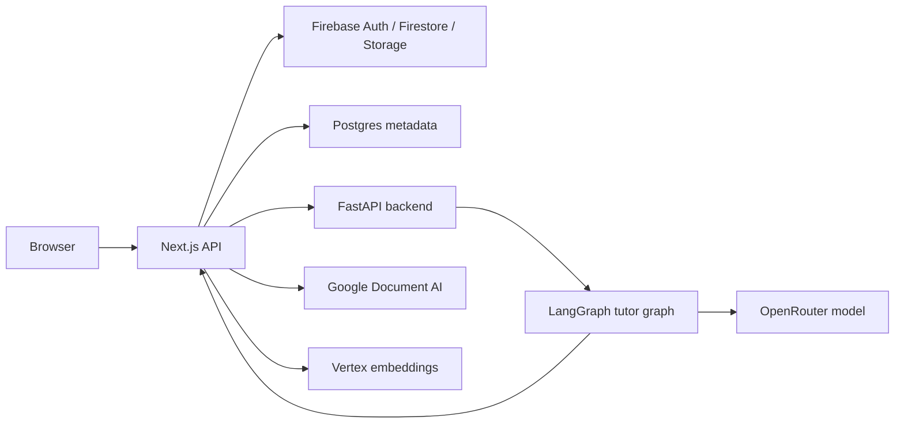
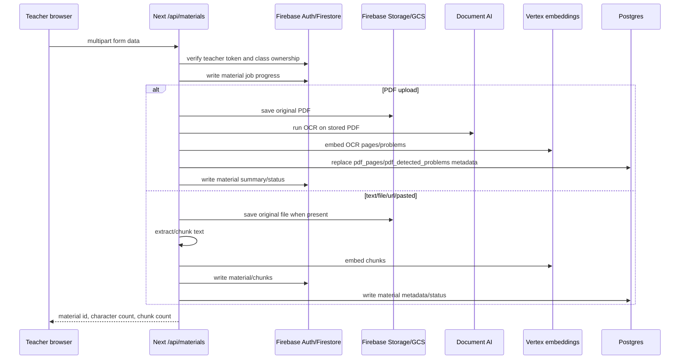
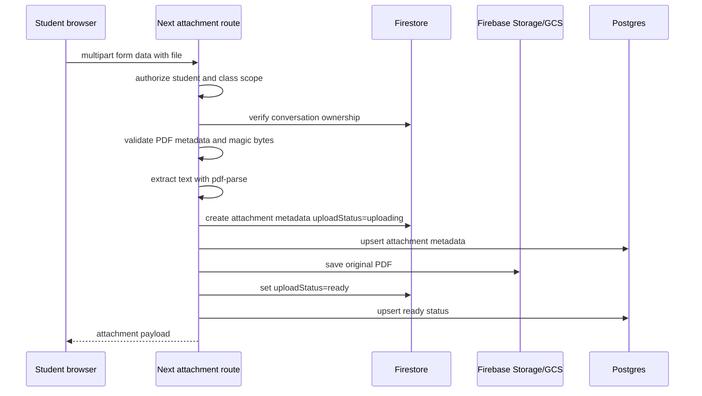
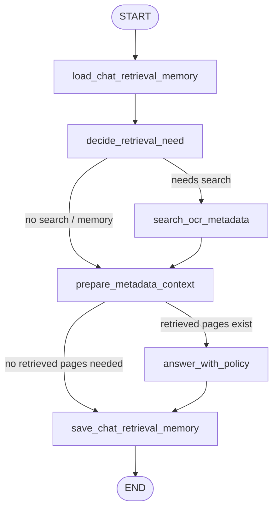

# Uploads and LangGraph Report

This report explains how uploads work and how the LangGraph tutor flow works in this codebase.

The repo contains both root-level `app/`, `lib/`, `components/` files and a newer `frontend/` tree. The more complete production path is in `frontend/`, especially for PDF OCR, Postgres material metadata, student attachments, audit logging, and internal retrieval routes. Root-level files are similar but older in several places.

## High-Level Architecture

Chandra has three major runtime pieces:

1. Next.js frontend/API routes in `frontend/app/api`.
2. Firebase Admin access from Next.js for Auth, Firestore, and Storage/GCS.
3. FastAPI/LangGraph backend in `backend/`, used only server-to-server by Next.js.

Student browser code does not call the Python backend directly. Browser requests go to Next.js. Next.js validates auth, persists conversation data, prepares the provider messages, reserves usage, then calls the private FastAPI backend at `/api/langgraph/chat` or `/api/langgraph/chat/stream`.

## Teacher Material Uploads

Teacher uploads are class-scoped tutor knowledge sources. They support:

- PDF file uploads.
- TXT, Markdown, and CSV file uploads.
- Pasted text.
- Non-PDF URLs.

The browser form is built in `components/TeacherClassManager.tsx`. `buildTutorKnowledgeFormData()` appends `classId`, `materialId`, `title`, `kind`, `text`, `sourceUrl`, and optionally `file`. It posts that form to `/api/materials`.

Primary files:

- `components/TeacherClassManager.tsx`
- `frontend/app/api/materials/route.ts`
- `frontend/lib/tutor-knowledge-server.ts`
- `frontend/lib/gemini-page-extractor.ts`
- `frontend/lib/pdf-ocr-postgres.ts`

### Request Flow

### Authorization

`frontend/app/api/materials/route.ts` accepts the POST, reads `request.formData()`, requires `classId`, and calls `authorizeClassTeacher()`. That verifies the Firebase ID token and checks that the authenticated UID owns the class.

Relevant code:

- `frontend/app/api/materials/route.ts`
- `frontend/lib/tutor-knowledge-server.ts`

### Upload Progress

The frontend creates a `jobId` before posting the form. The server creates a Firestore-backed progress writer with `createMaterialJobProgressWriter()`. Progress states include:

- `upload_received`
- `reading_file`
- `ocr_material`
- `chunking_material`
- `embedding_chunks`
- `saving_to_class`
- `ready`
- `failed`

The teacher UI subscribes to the material job and renders the progress while the server is saving, OCRing, embedding, and indexing the source.

### PDF Material Path

PDFs do not become Firestore tutor-knowledge chunks. In the current `frontend/` implementation, PDF uploads are indexed through Gemini structured page extraction and Postgres metadata.

The key branch is in `frontend/lib/tutor-knowledge-server.ts`: after the file is saved or read from Storage, if the source is a PDF and has a Storage path and bucket, `savePdfTutorKnowledgeOcrMetadata()` handles it.

PDF processing steps:

1. Save the original PDF to Firebase Storage/GCS at:
   `classes/{classId}/materials/{materialId}/original/{safeFileName}`.
2. Run Gemini structured page extraction on the stored PDF.
3. Convert OCR output into page records and detected problem records.
4. Create Google/Vertex retrieval-document embeddings for OCR pages/problems.
5. Replace the material's PDF structured PDF metadata in Postgres via `replacePdfOcrMetadata()`.
6. Write/upsert material metadata in Postgres with `searchMetadataSource: "postgres"`.
7. Write the Firestore material summary with `status: "ready"`, OCR counts, file path, storage bucket, and retrieval metadata.

So the PDF path is: original PDF in Storage -> Gemini structured page extraction -> page/problem records -> Google/Vertex embeddings -> Postgres metadata/vector rows -> Firestore material summary. This means PDF retrieval is page/problem metadata retrieval, not Firestore chunk retrieval.

The embedding call happens in `attachPdfOcrEmbeddings()`, which uses `createVertexEmbeddings()` with `taskType: "RETRIEVAL_DOCUMENT"` for each OCR page and detected problem that has text. Those embedding vectors are attached to the page/problem records before `replacePdfOcrMetadata()` writes them into Postgres.

### Text, Markdown, CSV, URL, and Pasted Text Path

Non-PDF material goes through the text chunk pipeline:

1. Validate source type.
2. Extract text from file, URL, or pasted content.
3. Chunk the text with tutor-knowledge chunking helpers.
4. Create Vertex retrieval-document embeddings for each chunk.
5. Store chunks under:
   `classes/{classId}/materials/{materialId}/chunks/{chunkId}`.
6. Write the material record in Firestore.
7. Upsert material metadata/status in Postgres.

If Vertex embedding fails, the server marks the material as failed/needs review and throws a `TutorKnowledgeHttpError`. In some paths it writes chunks without embeddings for diagnostic/review state, but it does not mark the source as student-ready.

### PDF Preview/Extract Endpoint

`frontend/app/api/materials/extract/route.ts` intentionally does not try to extract PDF text in the preview request. For PDFs, it returns:

`extractionMode: "google-document-ai-on-save"`

So PDF OCR happens on save, not during preview.

### Upload Session Endpoint

`frontend/app/api/materials/upload-session/route.ts` can create a material upload session and records it in both Postgres and Firestore. `saveTutorKnowledge()` also accepts `storagePath` and `storageBucket`, validates the path prefix, downloads the stored file, and processes it. This supports a direct-to-storage style flow, although the currently traced teacher form posts the `File` in the multipart `/api/materials` request.

## Student Homework Attachments

Student uploads are different from teacher material uploads. They are per-conversation homework attachments, not class-wide tutor knowledge sources.

Primary files:

- `frontend/app/api/student/conversations/[conversationId]/attachments/route.ts`
- `frontend/lib/student-attachments-server.ts`
- `frontend/app/api/chat/route.ts`

### Attachment Upload Flow

### Validation

Student attachments currently only support text-readable PDFs.

Validation includes:

- Student role is required.
- Conversation id must be safe.
- Conversation must exist and belong to the same student and class.
- File extension must be `.pdf`.
- MIME type, if provided, must be `application/pdf`.
- File must be non-empty.
- File must be no larger than 25 MB.
- Magic bytes must start with `%PDF-`.
- PDF must be readable by `pdf-lib`.
- Text must be extractable with `pdf-parse`.

The extracted text is capped before being stored. The server stores up to `maxExtractedAttachmentTextCharacters`, currently 12,000 characters.

### Storage and Metadata

Student attachments are saved to:

`student-uploads/{classId}/{studentUid}/{conversationId}/{attachmentId}-{safeFileName}`

Metadata is written first with `uploadStatus: "uploading"`. After Storage save succeeds, it is updated to `uploadStatus: "ready"`. If Storage save fails, it is updated to `uploadStatus: "failed"`.

The metadata is written to Firestore and opportunistically mirrored to Postgres through `tryPostgresData()`.

### How Attachments Reach the Tutor

When a student sends a chat message with `attachmentIds`, `frontend/app/api/chat/route.ts` calls conversation persistence. The attachment IDs are associated with the outgoing student message only if:

- Each attachment exists.
- Each attachment belongs to the same student/class/conversation.
- Each attachment is `ready`.
- The attachment is not already associated with a different message.

Then `appendAttachmentContextToStudentMessage()` appends a plain-text attachment context block to the latest student message. The actual PDF binary is not sent to the model. The tutor sees the file name, file type, size, page count, and extracted text snippet.

Important consequence: student homework attachments are chat-local context. They are not inserted into the class material retrieval index.

## Retrieval Indexing

There are two retrieval/storage models:

1. PDF class materials:
   - OCR pages/problems live in Postgres tables.
   - Retrieval goes through `/api/internal/pdf-page-search`.
   - Query embedding is created only as a fallback when exact/full-text search returns no pages.

2. Non-PDF class materials:
   - Chunks live in Firestore under the material.
   - Chunks have Vertex embeddings and source metadata.
   - These are still material records, but the LangGraph PDF page search path is specifically oriented around Postgres structured PDF metadata.

`frontend/app/api/internal/pdf-page-search/route.ts` is the internal search endpoint used by the Python backend. It:

1. Requires `X-Chandra-Internal-Secret`.
2. Validates class id, professor id, query, optional material id, and `topK`.
3. Calls `searchPdfOcrMetadata()` without a query vector first.
4. If no pages are found, creates a Vertex query embedding.
5. Calls `searchPdfOcrMetadata()` again with the vector.
6. Returns normalized page metadata to the Python backend.

`frontend/lib/pdf-ocr-postgres.ts` tries retrieval modes in this order:

1. Exact problem number.
2. Exact page number.
3. Title match.
4. Full-text match.
5. Vector match, if a query vector was supplied.

## LangGraph Chat Flow

LangGraph lives in the Python backend under `backend/agent/graph.py`.

Primary files:

- `frontend/app/api/chat/route.ts`
- `backend/main.py`
- `backend/agent/graph.py`
- `backend/agent/tools.py`
- `backend/agent/state.py`
- `frontend/app/api/internal/pdf-page-search/route.ts`
- `backend/retrieval/pdf_page_assets.py`

### Next.js to Backend

The student chat route builds a backend request in `frontend/app/api/chat/route.ts`.

It does the following before calling Python:

1. Validates the request body.
2. Authorizes the tutor chat request.
3. Loads teacher class config.
4. Loads student learning profile context for student accounts.
5. Builds the tutor system prompt and PDF retrieval/tool-selection instructions.
6. Persists conversation/message data.
7. Appends attachment context to the latest student message, if present.
8. Converts messages to provider format.
9. Estimates and reserves AI usage for students.
10. Calls the FastAPI backend.

Non-streaming calls go to:

`POST {BACKEND_API_BASE_URL}/api/langgraph/chat`

Streaming calls go to:

`POST {BACKEND_API_BASE_URL}/api/langgraph/chat/stream`

The backend request includes class id, conversation id, latest student message id, professor id/name, student id, model settings, answer policy, source usage settings, student learning profile context, usage reservation, and provider messages.

### FastAPI Entry Points

`backend/main.py` exposes two protected endpoints:

- `/api/langgraph/chat`
- `/api/langgraph/chat/stream`

Both require the internal shared secret header. Both validate message payload size and enforce the AI usage reservation before running the graph.

Non-streaming imports and calls `run_pdf_rag_agent()`.

Streaming imports and iterates `run_pdf_rag_agent_stream()`, yielding newline-delimited JSON events.

### State Shape

The graph state is defined in `backend/agent/state.py` as `PdfRagState`.

Important state fields include:

- `messages`
- `tool_calls`
- `retrieved_pages`
- `page_assets`
- `answer`
- `stage_history`
- `search_queries`
- `model`, `temperature`, `max_tokens`, `reasoning_effort`
- `answer_policy`
- `source_usage`
- `student_profile_context`
- `class_id`, `conversation_id`, `professor_id`, `student_id`
- `sources`
- `retrieval_confidence`
- `retrieval_diagnostics`
- `chat_retrieval_memory`
- `selected_metadata_records`
- `structured_output_override`
- `token_usage`
- `input_token_breakdown`

### Actual LangGraph Nodes

The non-streaming graph is built with `StateGraph(PdfRagState)` in `build_pdf_rag_graph()`.

Nodes:

1. `load_chat_retrieval_memory`
   - Loads retrieval memory for the conversation.
   - This helps avoid repeated failed searches and supports follow-ups to previous source-backed answers.

2. `decide_retrieval_need`
   - Builds a heuristic retrieval decision.
   - Calls the model through OpenRouter with a low reasoning effort router prompt.
   - Parses whether the tutor should search class PDF/structured PDF metadata.
   - If no search is needed, it can produce the student-facing response immediately.
   - If search is needed, it emits a `search_pdf_pages` tool call shape.

3. `search_ocr_metadata`
   - Executes parsed `search_pdf_pages` calls.
   - Calls the internal Next.js PDF page search endpoint unless a mock retriever was injected for tests.
   - Deduplicates page windows.
   - Builds source metadata, diagnostics, confidence, and query history.

4. `prepare_metadata_context`
   - Fetches or normalizes page assets for retrieved pages.
   - Uses previous memory when a follow-up can be answered from active retrieved context.
   - Produces selected metadata records/page assets for the final answer prompt.

5. `answer_with_policy`
   - Builds the final multimodal/metadata-grounded messages.
   - Adjusts usage reservation based on actual final prompt size.
   - Calls the answer model through OpenRouter.
   - Records answer, finish reason, token usage, and input token breakdown.

6. `save_chat_retrieval_memory`
   - Builds and saves updated retrieval memory for the conversation.
   - Ends the graph.

Graph routing:

### Search Tool

The graph's search tool is defined in `backend/agent/tools.py` as `SEARCH_PDF_PAGES_TOOL`.

The tool is not a browser-visible function. It is an internal model/tool abstraction. The router decision creates tool-call-like objects, then Python executes them directly.

`search_pdf_pages()` calls `search_pdf_pages_via_next()` when no test retriever is injected. That sends a POST to:

`{NEXT_BASE_URL}/api/internal/pdf-page-search`

with:

- `classId`
- `professorId`
- `query`
- `retrievalReason`
- `topK`

The request includes `X-Chandra-Internal-Secret`.

### Why LangGraph Uses Next.js for Retrieval

The Python backend does not directly own the Postgres/Firestore material search APIs. Instead, it calls the internal Next.js route. This keeps retrieval authorization/config and Postgres access centralized in the Next.js server while the Python backend focuses on orchestration and model calls.

### Non-Streaming vs Streaming

Non-streaming uses the compiled LangGraph:

- `build_pdf_rag_graph()`
- `graph.ainvoke(initial_state, {"recursion_limit": 40})`

Streaming does not call the compiled graph directly. `run_pdf_rag_agent_stream()` manually mirrors the same steps so it can emit progress events at useful points:

- search batch started
- quick response from retrieval decision
- preparing grounded answer
- final payload
- error payload

That means the streaming and non-streaming paths must be kept behaviorally aligned when changing graph logic.

### Final Response Assembly

After graph execution, `pdf_rag_response_from_state()` builds the API response shape. It:

1. Chooses the answer or a page fallback.
2. Builds answer sources.
3. Parses/updates active problem context.
4. Removes hidden problem-context markup from student-visible text.
5. Applies fallback behavior if the answer is empty.
6. Returns sources, structured output, trace/debug fields, usage, confidence, and answer text.

Before returning to the student, `run_pdf_rag_agent()` also applies an answer leak guard. This is meant to block or rewrite homework-ready final answers when policy says the tutor should scaffold instead of give a direct submission-ready answer.

## End-to-End Example: Teacher PDF Upload to Student Retrieval

1. Teacher uploads a PDF material.
2. Next.js verifies the teacher owns the class.
3. Original PDF is saved in Firebase Storage/GCS.
4. Gemini structured page extraction extracts page text.
5. The app detects pages/problems.
6. Google/Vertex embeddings are created for those OCR page/problem records.
7. Postgres receives `pdf_pages`, `pdf_detected_problems`, material metadata, and the embedding vectors.
8. Firestore receives a ready material summary for the class UI.
9. Student asks about a page/problem/worksheet.
10. Next.js sends the chat request to FastAPI/LangGraph.
11. LangGraph decides whether retrieval is needed.
12. If needed, LangGraph calls internal Next.js PDF search.
13. Next.js searches Postgres structured PDF metadata.
14. LangGraph builds a grounded final prompt with the selected metadata.
15. OpenRouter returns the final answer.
16. Next.js finalizes token usage and persists the assistant message.

## End-to-End Example: Student Attachment to Tutor Answer

1. Student uploads a text-readable PDF attachment to a conversation.
2. Next.js validates ownership, file type, PDF bytes, page count, and extractable text.
3. Attachment metadata is saved with `uploadStatus: "uploading"`.
4. Original PDF is saved to Firebase Storage/GCS.
5. Metadata is updated to `uploadStatus: "ready"`.
6. Student sends a message with the attachment id.
7. Next.js associates the attachment with that message.
8. Next.js appends extracted attachment text to the latest student message.
9. The Python backend receives that text as part of the provider messages.
10. LangGraph may still search class materials if the question calls for class PDF retrieval.

## Important Gotchas

1. Student attachments are not added to the class retrieval index.
   - They are extracted into message context only.
   - They are useful for the current chat message, not future class-wide retrieval.

2. Teacher PDFs are not Firestore chunks in `frontend/`.
   - They are Gemini structured page extraction records in Postgres.
   - The Firestore material doc is mostly summary/status/visibility metadata.

3. The streaming path mirrors the graph manually.
   - Changes to the compiled graph nodes should usually be reflected in `run_pdf_rag_agent_stream()`.

4. Retrieval depends on internal secrets.
   - FastAPI endpoints require the backend shared secret.
   - Python-to-Next retrieval also requires `BACKEND_SHARED_SECRET`.

5. PDF OCR requires configured infrastructure.
   - Document AI env/config must exist.
   - Postgres PDF structured PDF metadata database must be configured.
   - Vertex embeddings must be configured for semantic fallback/vector retrieval.

6. The code has duplicate root and `frontend/` trees.
   - When debugging production behavior, prefer the `frontend/` route/lib files unless deployment config proves the root copy is active.

## File Reference Map

- Teacher upload UI: `components/TeacherClassManager.tsx`
- Teacher material API: `frontend/app/api/materials/route.ts`
- Teacher material save/index logic: `frontend/lib/tutor-knowledge-server.ts`
- Gemini structured page extractor: `frontend/lib/gemini-page-extractor.ts`
- PDF OCR Postgres search/write logic: `frontend/lib/pdf-ocr-postgres.ts`
- Internal PDF retrieval route: `frontend/app/api/internal/pdf-page-search/route.ts`
- Student attachment API: `frontend/app/api/student/conversations/[conversationId]/attachments/route.ts`
- Student attachment storage/extraction logic: `frontend/lib/student-attachments-server.ts`
- Student chat API: `frontend/app/api/chat/route.ts`
- FastAPI backend entrypoints: `backend/main.py`
- LangGraph implementation: `backend/agent/graph.py`
- LangGraph state: `backend/agent/state.py`
- LangGraph retrieval tool: `backend/agent/tools.py`
- Page asset helper used by graph: `backend/retrieval/pdf_page_assets.py`
